# Homework 1 - Scale Invariant Feature Detection and Image Filtering
Detail : [Link](hw1.pdf)

## Usage
```shell
# Build anaconda virtual environment
conda create --name dlcv_hw1 python=3.6.9
conda activate dlcv_hw1

# Install required package
pip3 install -r requirements.txt
```

## Part 1
### Visualize the DoG images for 1.png
||DoG Image (threshold = 5)||DoG Image (threshold = 5)|
|-|-|-|-|
|DoG1-1.png||DoG2-1.png|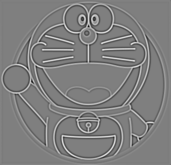|
|DoG1-2.png|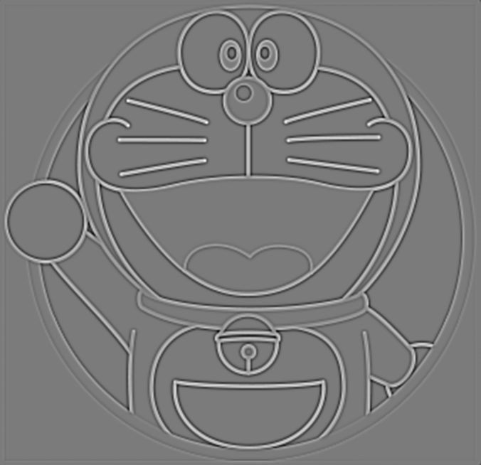|DoG2-2.png|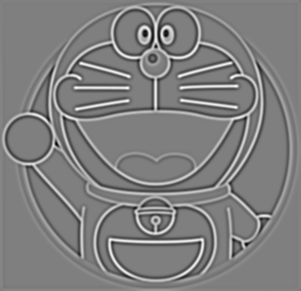|
|DoG1-3.png|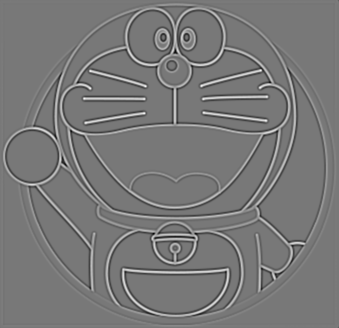|DoG2-3.png||
|DoG1-4.png|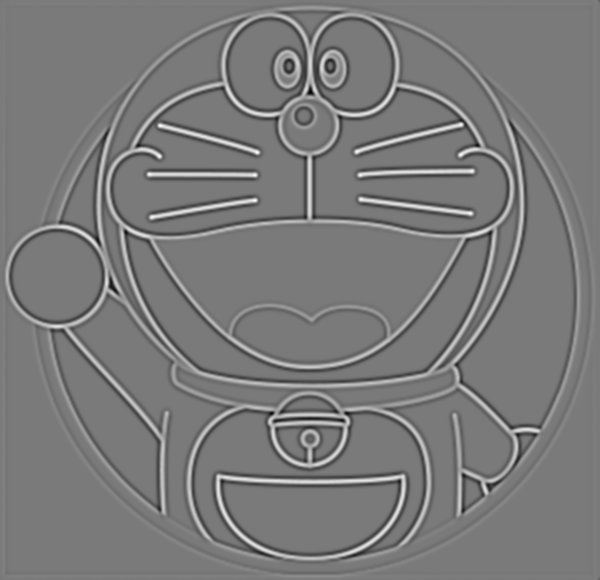|DoG2-4.png|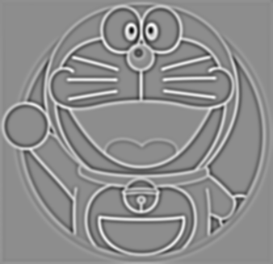|

### Use three thresholds (2, 5, 7) on 2.png and describe the difference
|Threshold|Image with detected keypoints on 2.png|
|-|-|
|2|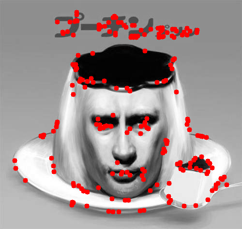|
|5|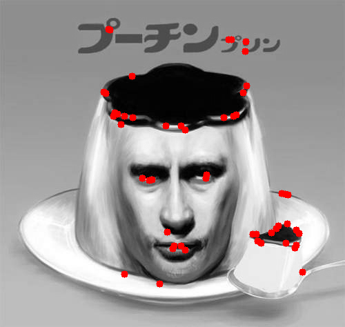|
|7|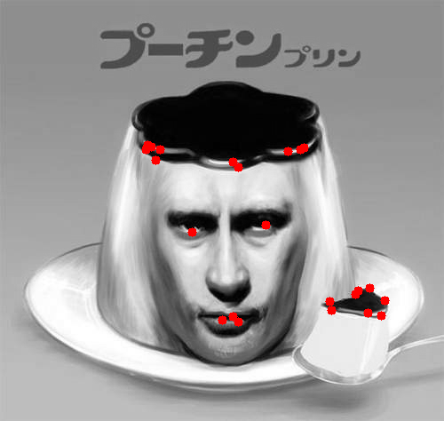|

## Part 2
### Report the cost for each filtered image
|Gray Scale Setting|Cost (1.png)|Gray Scale Setting|Cost (2.png)|
|-|-|-|-|
|cv2.COLOR_BGR2GRAY|1207799|cv2.COLOR_BGR2GRAY|183850|
|R*0.0+G*0.0+B*1.0|1439568|R*0.1+G*0.0+B*0.9|77882|
|R*0.0+G*1.0+B*0.0|1305961|R*0.2+G*0.0+B*0.8|86023|
|R*0.1+G*0.0+B*0.9|1393620|R*0.2+G*0.8+B*0.0|188019|
|R*0.1+G*0.4+B*0.5|1279697|R*0.4+G*0.0+B*0.6|128341|
|R*0.8+G*0.2+B*0.0|1127913|R*1.0+G*0.0+B*0.0|110862|

### Show original RGB image / two filtered RGB images and two grayscale images with highest and lowest cost
|Original RGB image (1.png)|Filtered RGB image and Grayscale image of Highest cost|Filtered RGB image and Grayscale image of Lowest cost|
|-|-|-|
||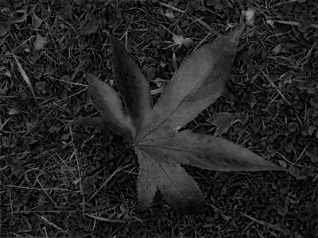||

|Original RGB image (2.png)|Filtered RGB image and Grayscale image of Highest cost|Filtered RGB image and Grayscale image of Lowest cost|
|-|-|-|
||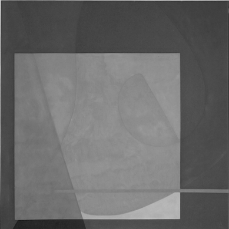|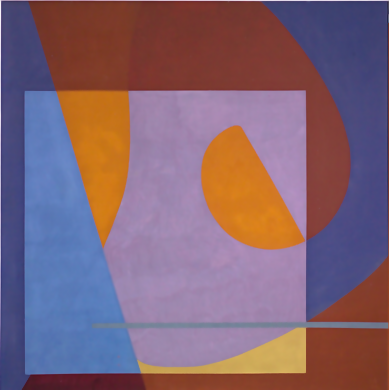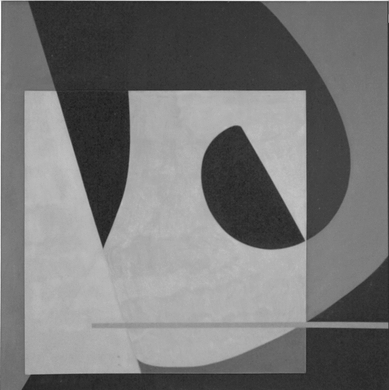|