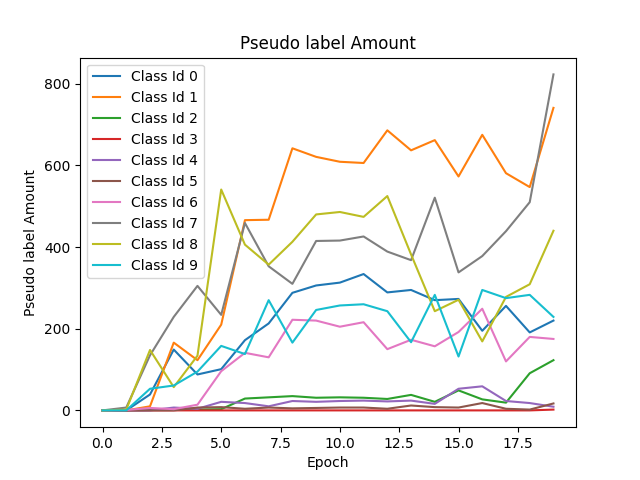
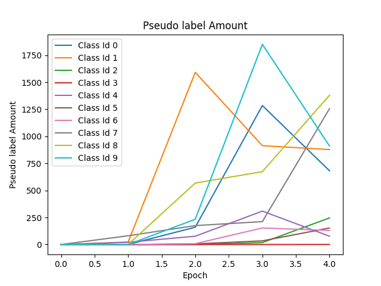

# Homework 2 - Scene Recognition & Image Classification Using CNN
Detail : [Link](hw2.pdf)

Dataset : [Link](https://drive.google.com/u/1/uc?id=1Uq1_00JtfZ8ETueo8RjPvL6ANhIc1qvD&export=download)

## Usage
```shell
# Build anaconda virtual environment
$ conda create --name dlcv_hw2 python=3.7.6
$ conda activate dlcv_hw2

# Install required package
$ pip3 install -r requirements.txt

# Install cyvlfeat
$ conda install -c conda-forge cyvlfeat
```

## Part 1
### Plot confusion matrix of two settings. (i.e. Bag of sift and tiny image representation)
|Feature|Confusion Matrix|
|-|-|
|Tiny Image (Accuracy : `24.2%`)||
|Bag of SIFT (Accuracy : `60.7%`)||

## Part 2
### Compare the performance on residual networks and LeNet. Plot the learning curve (loss and accuracy) on both training and validation sets for both 2 schemes. 8 plots in total

|Hyperparameter|Value|
|-|-|
|Split ratio|0.9|
|Batch size|256|
|Learning rate|0.05|
|Epoch|200|
|Optimizer|SGD|
|Momentum|0.9|
|Weight decay|0.0005|
|Learning rate scheduler|OneCycleLR|
|Percentage of the cycle|0.2|
|Loss function|CrossEntropy|
|Pseudo label threshold|0.99|
|Add pseudo labels|per 10 epochs (start to add after epoch 20)|

### LeNet (with pseudo label)
* #### Model Summary
```markdown
----------------------------------------------------------------
        Layer (type)               Output Shape         Param #
================================================================
            Conv2d-1            [-1, 6, 28, 28]             456
              ReLU-2            [-1, 6, 28, 28]               0
         MaxPool2d-3            [-1, 6, 14, 14]               0
            Conv2d-4           [-1, 16, 10, 10]           2,416
              ReLU-5           [-1, 16, 10, 10]               0
         MaxPool2d-6             [-1, 16, 5, 5]               0
            Linear-7                  [-1, 120]          48,120
              ReLU-8                  [-1, 120]               0
            Linear-9                   [-1, 84]          10,164
             ReLU-10                   [-1, 84]               0
           Linear-11                   [-1, 10]             850
================================================================
Total params: 62,006
Trainable params: 62,006
Non-trainable params: 0
----------------------------------------------------------------
Input size (MB): 0.01
Forward/backward pass size (MB): 0.11
Params size (MB): 0.24
Estimated Total Size (MB): 0.36
----------------------------------------------------------------
```

* #### Performance
||Loss|Accuracy|
|-|-|-|
|Training|||
|Validation||

* #### Pseudo Label
    Unlabel images : `30000`
    Images with pseudo label : `2741`
    Pseudo labels reuse rate : `9.14%`
    

* #### Evaluation
    Total training time : `59 min 51 sec` 
    Accuracy : `66.98%`


### My Resnet (with pseudo label)
* #### Model Summary
```markdown
----------------------------------------------------------------
        Layer (type)               Output Shape         Param #
================================================================
            Conv2d-1           [-1, 64, 32, 32]           1,728
       BatchNorm2d-2           [-1, 64, 32, 32]             128
            Conv2d-3           [-1, 64, 32, 32]          36,864
       BatchNorm2d-4           [-1, 64, 32, 32]             128
            Conv2d-5           [-1, 64, 32, 32]          36,864
       BatchNorm2d-6           [-1, 64, 32, 32]             128
        BasicBlock-7           [-1, 64, 32, 32]               0
            Conv2d-8           [-1, 64, 32, 32]          36,864
       BatchNorm2d-9           [-1, 64, 32, 32]             128
           Conv2d-10           [-1, 64, 32, 32]          36,864
      BatchNorm2d-11           [-1, 64, 32, 32]             128
       BasicBlock-12           [-1, 64, 32, 32]               0
           Conv2d-13          [-1, 128, 16, 16]          73,728
      BatchNorm2d-14          [-1, 128, 16, 16]             256
           Conv2d-15          [-1, 128, 16, 16]         147,456
      BatchNorm2d-16          [-1, 128, 16, 16]             256
           Conv2d-17          [-1, 128, 16, 16]           8,192
      BatchNorm2d-18          [-1, 128, 16, 16]             256
       BasicBlock-19          [-1, 128, 16, 16]               0
           Conv2d-20          [-1, 128, 16, 16]         147,456
      BatchNorm2d-21          [-1, 128, 16, 16]             256
           Conv2d-22          [-1, 128, 16, 16]         147,456
      BatchNorm2d-23          [-1, 128, 16, 16]             256
       BasicBlock-24          [-1, 128, 16, 16]               0
           Conv2d-25            [-1, 256, 8, 8]         294,912
      BatchNorm2d-26            [-1, 256, 8, 8]             512
           Conv2d-27            [-1, 256, 8, 8]         589,824
      BatchNorm2d-28            [-1, 256, 8, 8]             512
           Conv2d-29            [-1, 256, 8, 8]          32,768
      BatchNorm2d-30            [-1, 256, 8, 8]             512
       BasicBlock-31            [-1, 256, 8, 8]               0
           Conv2d-32            [-1, 256, 8, 8]         589,824
      BatchNorm2d-33            [-1, 256, 8, 8]             512
           Conv2d-34            [-1, 256, 8, 8]         589,824
      BatchNorm2d-35            [-1, 256, 8, 8]             512
       BasicBlock-36            [-1, 256, 8, 8]               0
           Conv2d-37            [-1, 512, 4, 4]       1,179,648
      BatchNorm2d-38            [-1, 512, 4, 4]           1,024
           Conv2d-39            [-1, 512, 4, 4]       2,359,296
      BatchNorm2d-40            [-1, 512, 4, 4]           1,024
           Conv2d-41            [-1, 512, 4, 4]         131,072
      BatchNorm2d-42            [-1, 512, 4, 4]           1,024
       BasicBlock-43            [-1, 512, 4, 4]               0
           Conv2d-44            [-1, 512, 4, 4]       2,359,296
      BatchNorm2d-45            [-1, 512, 4, 4]           1,024
           Conv2d-46            [-1, 512, 4, 4]       2,359,296
      BatchNorm2d-47            [-1, 512, 4, 4]           1,024
       BasicBlock-48            [-1, 512, 4, 4]               0
           Linear-49                   [-1, 10]           5,130
================================================================
Total params: 11,173,962
Trainable params: 11,173,962
Non-trainable params: 0
----------------------------------------------------------------
Input size (MB): 0.01
Forward/backward pass size (MB): 11.25
Params size (MB): 42.63
Estimated Total Size (MB): 53.89
----------------------------------------------------------------
```

* #### Performance
||Loss|Accuracy|
|-|-|-|
|Training|||
|Validation||

* #### Pseudo Label
    Unlabel images : `30000`
    Images with pseudo label : `23405`
    Pseudo labels reuse rate : `78.02%`
    

* #### Evaluation
    Total training time : `210 min 53 sec` 
    Accuracy : `87.28%`