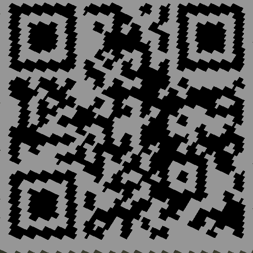
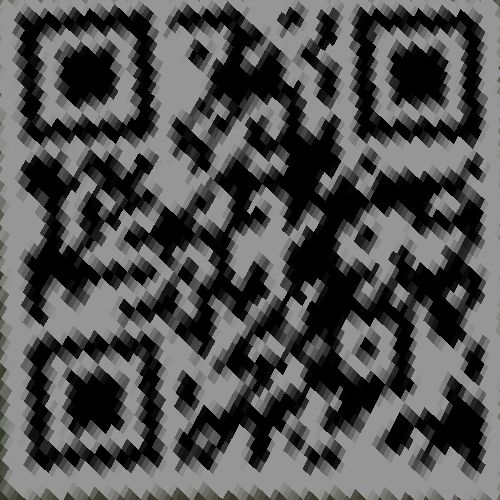

# Homework 3 - Projective Geometry
Detail : [Link](hw3.pdf)

## Usage
```shell
# Build anaconda virtual environment
$ conda create --name dlcv_hw3 python=3.6.9
$ conda activate dlcv_hw3

# Install required package
$ pip3 install -r requirements.txt
```

## Part 1 - Homography estimation
### Paste the function code solve_homography(u, v) & your warped canvas


## Part 2 - Marker-Based Planar AR


## Part 3 - Unwarp the secret
### Paste the 2 warped images (Nearest Neighbor)
|||
|-|-|

### Paste the 2 warped images (Bilinear Interpolation)
|||
|-|-|

## Part 4 - Panorama
### Paste your stitched panorama
