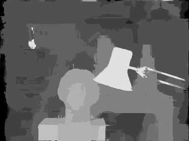
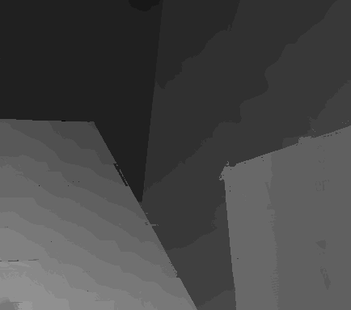
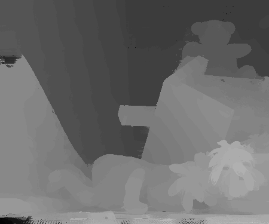
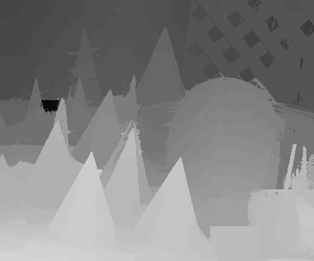

# Homework 4 - Stereo Matching
Detail : [Link](hw4.pdf)

## Usage
```shell
# Build anaconda virtual environment
$ conda create --name cv_hw4 python=3.6.9
$ conda activate cv_hw4

# Install required package
$ pip3 install -r requirements.txt
```

### Visualize the disparity map of 4 testing images
|Tsukuba|Venus|
|-|-|
|||
|Teddy|Cones|
|||

### Report the bad pixel ratio of 2 testing images with given ground truth (Tsukuba/Teddy)
||bad pixel ratio|
|-|-|
|Tsukuba|`3.08%`|
|Teddy|`9.19%`|
